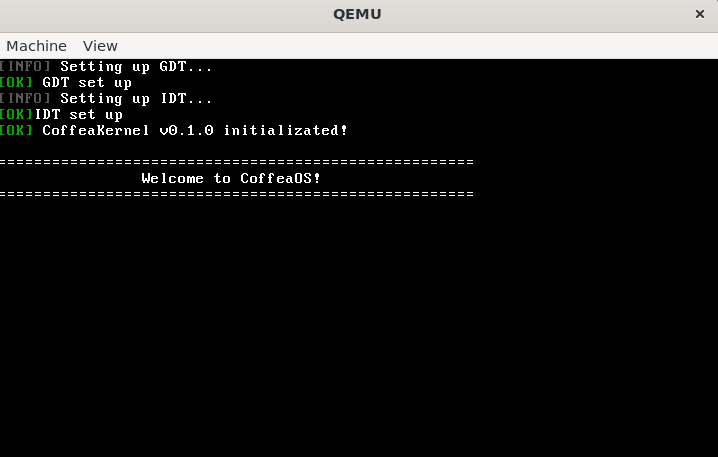
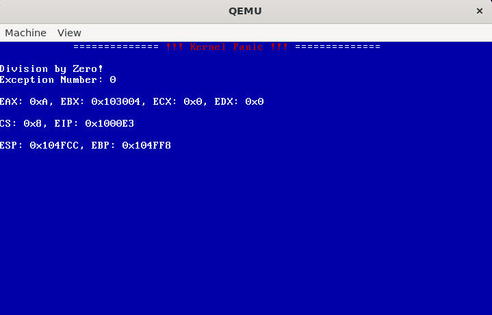

# CoffeaOS☕
Sistema operacional de 32 bits para arquitetura x86 sendo desenvolvido do zero com fins de estudo e compreensão de desenvolvimento em baixo nível.

## Sobre
CoffeaOS é um projeto de hobby totalmente voltado a estudo e implementação de sistemas complexos em baixo nível.

A ideia surgiu da curiosidade em entender: comunicação software/hardware em baixo nível, programação em um ambiente com zero dependências externas, algoritmos triviais para gerenciamento de memória, processos, user mode e etc.

## Screenshot




## Features
- Modo protegido (32 bits)
- Bootloader multiboot v1
- Kernel em C e Assembly (NASM)
- Drivers:
    - VGA text mode para output
    - UART 16550 para comunicação serial

## Como rodar?
O desenvolvimento e testes estão sendo realizados em um ambiente Linux, para ser mais específico em uma distro Ubuntu.

```bash
# Dependências
sudo apt install build-essential nasm genisoimage qemu-system-i386 make gcc

# Build
make

# Executa OS
make run
```

## Referências
- [The Little OS Book](https://littleosbook.github.io)
- [OSDev Wiki](https://wiki.osdev.org)
- [Gitbook Assembly x86 - Mente Binária](https://mentebinaria.gitbook.io/assembly)
- [Manual Intel x86-64 e IA-32 (importante para segmentação GDT)](https://www.intel.com/content/www/us/en/developer/articles/technical/intel-sdm.html)

## Autor

Desenvolvido por Afonso Dolmen
